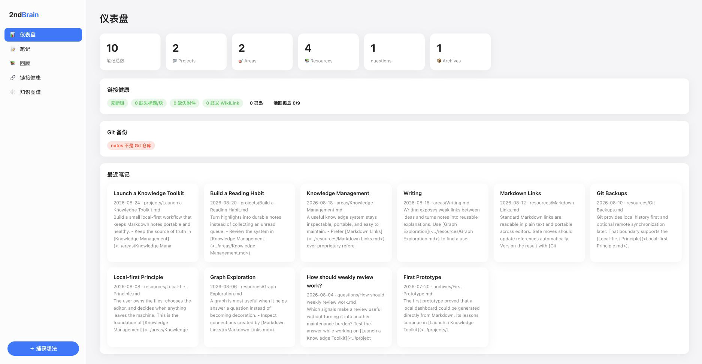
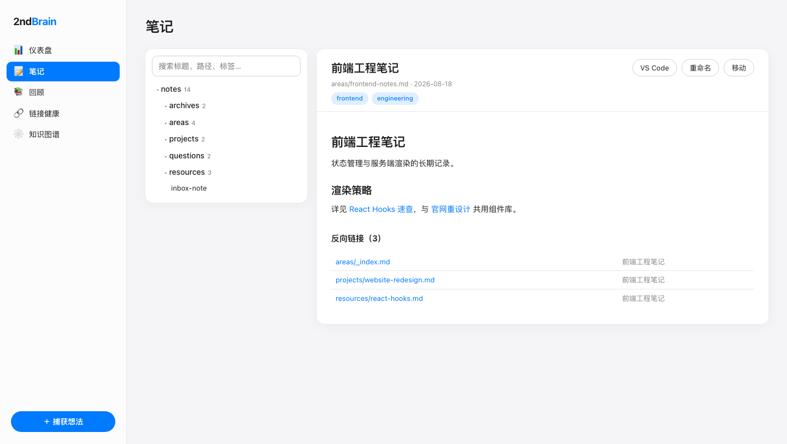
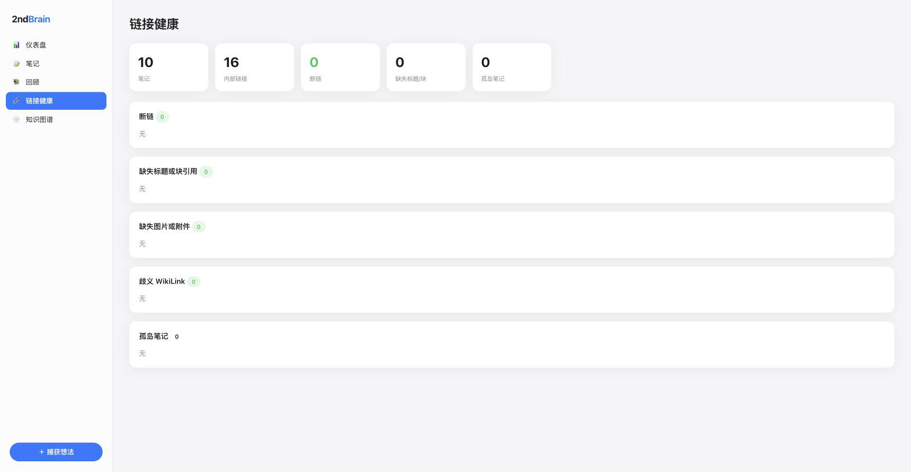
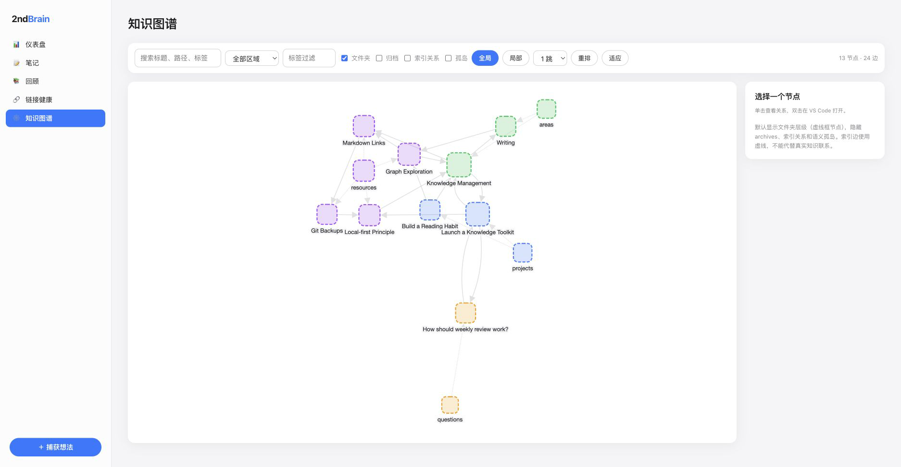

# 🧠 2ndBrain CLI

> 本地优先的「第二大脑」：Markdown + PARA + Git，一条命令管好你的知识库。


`brain-cli` 是一个本地 Markdown 笔记管理工具：命令行快速捕获、回顾、体检链接，配上一个开箱即用的仪表盘、笔记浏览、知识图谱一应俱全。所有数据都在本地，笔记目录就是一个普通的 Git 仓库，备份、同步、加密完全由你掌控。

> 注：本工具只做本地 Markdown + Git 这一件事，并把它做好。

## ✨ 功能特性

- 💡 **快速捕获** —— `brain capture` 一条命令落盘，frontmatter、目录归属全自动
- 🗂 **PARA 结构** —— `projects / areas / resources / archives`（外加 `questions`），`brain init` 一键初始化
- 🔗 **链接体检** —— 断链、缺失标题、非标准 WikiLink、孤岛笔记，`brain links` 一目了然
- ✏️ **安全重构** —— 重命名 / 移动笔记时自动重写所有引用链接、同步图片目录
- 🕸 **知识图谱** —— 语义链接 + 文件夹层级双重视图，cytoscape 力导向布局，支持局部 1/2 跳探索
- 🌐 **WebUI** —— 仪表盘 / 笔记 / 回顾 / 链接健康 / 图谱；内置 chokidar 监听 + SSE 推送，**文件一变页面自动刷新**
- 💾 **Git 自动备份** —— 后台守护进程定时提交、按需推送，且**严格只动 notes 仓库**（见[安全边界](#-git-安全边界)）

## 📸 截图

| 仪表盘 | 笔记浏览 |
| --- | --- |
|  |  |

| 链接健康 | 知识图谱 |
| --- | --- |
|  |  |

## 🚀 快速开始

### 方式一：npm 安装（推荐）

```bash
npm install -g @qwtang/brain-cli
```

### 方式二：源码安装

```bash
git clone https://github.com/tangquanwei/brain-cli.git
cd brain-cli
npm install
npm run build
npm link          # 可选：把 `brain` 放到 PATH
```

初始化并启动：

```bash
brain init        # 创建 PARA 目录结构
brain web --open  # 启动 WebUI 并在浏览器打开（默认 http://127.0.0.1:3739）
```

也可以不全局链接，直接 `node dist/cli.js <command>` 或开发模式 `npm run dev -- <command>`。

## ⌨️ 命令一览

| 命令 | 说明 |
| --- | --- |
| `brain init` | 🏗️ 初始化第二大脑目录结构 |
| `brain status` | 📊 查看笔记统计与 Git 状态 |
| `brain capture <title> [-c 内容] [-t 标签]` | 💡 快速本地捕获想法（别名 `brain new`） |
| `brain review week\|month\|tags <标签>\|random [n]` | 📚 笔记回顾 |
| `brain rename <路径> <新名称>` | ✏️ 重命名笔记，自动同步图片目录和引用链接 |
| `brain move <路径> <新路径>` | 🚚 移动笔记，自动重写相对链接 |
| `brain links [--check]` | 🔗 检查标准 Markdown 链接（断链 / 缺失标题 / 孤岛） |
| `brain backlinks <笔记>` | ↩️ 查看某篇笔记的反向链接 |
| `brain backup [-m 消息] [--push]` | 💾 仅提交（可选推送）notes Git 仓库 |
| `brain watch start\|stop\|status` | 🤖 后台守护进程：notes 变更自动提交 / 定时推送 |
| `brain web [--open] [-p 端口]` | 🌐 启动统一 WebUI |

## ⚙️ 配置

在仓库根目录创建 `.env`（参考 `.env.example`）：

| 变量 | 默认值 | 说明 |
| --- | --- | --- |
| `NOTES_DIR` | `notes` | 笔记目录（相对仓库根目录或绝对路径） |
| `GIT_AUTO_COMMIT` | `true` | 捕获 / 移动后自动提交 notes |
| `COMMIT_INTERVAL` | `30` | 守护进程提交间隔（秒） |
| `PUSH_INTERVAL` | `900` | 守护进程推送间隔（秒） |
| `WATCH_ENABLED` | `true` | 是否启用后台守护 |

## 🌐 WebUI

`brain web` 启动一个只监听 `127.0.0.1` 的本地服务，前端为打包成单文件的 React 应用：

- **仪表盘**：笔记统计、链接健康概览、Git 备份状态、最近笔记
- **笔记**：目录树 + 搜索 + Markdown 阅读器 + 反向链接，支持重命名 / 移动 / 一键在 VS Code 打开
- **回顾**：本周 / 本月 / 随机漫步 / 按标签
- **链接健康**：断链、缺失标题、非标准链接、孤岛笔记清单
- **知识图谱**：文件夹节点（虚线框）把没有显式链接的笔记也连成整体；区域配色、标签过滤、局部 1/2 跳、归档 / 索引 / 孤岛开关

服务端通过 chokidar 监听笔记目录，变更经防抖后由 SSE（`/api/events`）推送到页面，**在 Obsidian / VS Code 里保存文件，WebUI 即刻刷新**。

## 🔒 Git 安全边界

`brain backup` 与守护进程**只提交、只推送 `NOTES_DIR` 指向的笔记仓库**，永远不会触碰外层项目仓库、`blog/` 或其他目录。

笔记目录通常是你自己的独立 Git 仓库（普通目录或 Git 子模块均可）：

```bash
brain backup -m "Update notes" --push   # 只提交并推送 notes
```

如果笔记仓库以子模块形式挂在某个主项目下，子模块指针的提交由你在主项目中自行完成，`brain` 绝不代为操作。

## 🏗 技术栈

| 技术 | 用途 |
| --- | --- |
| TypeScript | 全项目开发语言，CLI 与 WebUI 共用类型定义 |
| commander | 命令行解析：子命令、选项、帮助信息 |
| chokidar | 监听笔记目录文件变化，驱动自动提交与 WebUI 实时刷新 |
| gray-matter | 解析笔记 frontmatter（标题、标签、日期） |
| simple-git | notes 仓库的提交、推送、状态查询 |
| React 19 | WebUI 前端框架 |
| cytoscape | 知识图谱的力导向布局与交互渲染 |
| tsup | 打包：CLI 产物 + WebUI 单文件 bundle |
| Vitest | 单元测试框架 |

## 🏛️ 项目结构
```
src/
  cli.ts        # 命令入口（commander）
  commands/     # init / capture / backup / review / rename / move / links / web …
  graph/        # 链接图投影、过滤、目录树
  utils/        # Markdown 链接解析、笔记索引、Git、路径安全
  watcher/      # 后台守护进程与变更检测
  web/          # 内置 HTTP 服务、数据接口、SSE 推送
web-ui/         # React 前端（tsup 打包为 dist/web/app.global.js 单文件）
tests/          # Vitest 单元测试
```

## 🛠 开发

| 脚本 | 说明 |
| --- | --- |
| `npm run dev -- <command>` | tsx 直接运行源码 |
| `npm test` / `npm run test:watch` | Vitest 单元测试 |
| `npm run typecheck` | `tsc` 双工程（CLI + WebUI）类型检查 |
| `npm run build` | tsup 打包 CLI 与 WebUI |
| `npm run verify` | 测试 + 类型检查 + 构建 + 链接检查 |

---

## 📝 License

[Apache-2.0](LICENSE)

如果它对你的知识管理有帮助，欢迎 Star ⭐ 与提 Issue。
