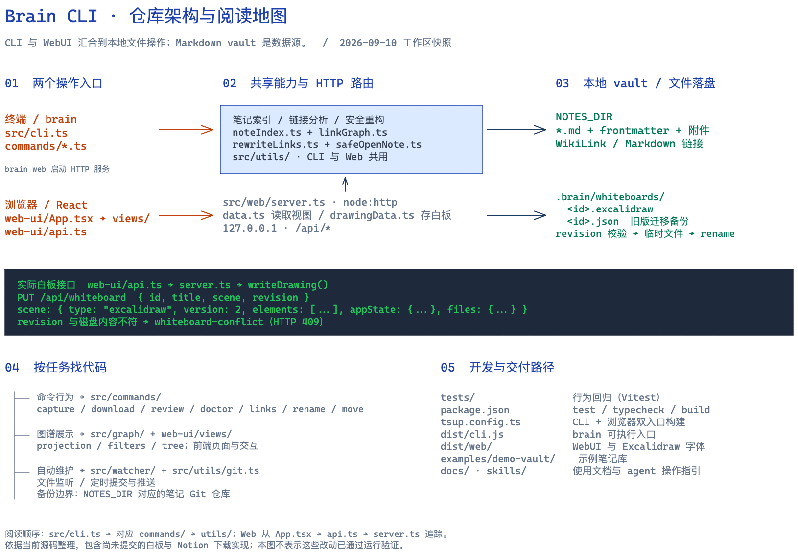

# Brain CLI 仓库地图

基于 2026-09-10 当前工作区源码梳理，包含未提交实现；不是已发布版本的功能承诺。

[打开可编辑 Excalidraw 图](brain-cli.excalidraw) · [查看 PNG](brain-cli.png)

## 从哪里读起

| 想了解或修改 | 入口与调用路径 |
| --- | --- |
| CLI 命令与参数 | [`src/cli.ts`](../../src/cli.ts) → [`src/commands/`](../../src/commands/) |
| 笔记扫描与链接诊断 | [`noteIndex.ts`](../../src/utils/noteIndex.ts) 建立笔记索引；[`linkGraph.ts`](../../src/utils/linkGraph.ts) 配合 [`markdownLinks.ts`](../../src/utils/markdownLinks.ts) 解析引用 |
| 重命名、移动与链接重写 | [`move.ts`](../../src/commands/move.ts) → [`rewriteLinks.ts`](../../src/utils/rewriteLinks.ts) 的 `buildNoteMovePlan` / `applyNoteMovePlan`；Web 路由也使用这两个函数 |
| WebUI | [`App.tsx`](../../web-ui/App.tsx) → `views/` → [`api.ts`](../../web-ui/api.ts) → [`server.ts`](../../src/web/server.ts) |
| 图谱数据转换 | [`src/graph/`](../../src/graph/) 中的 projection、filters、tree |
| 白板编辑与持久化 | [`Whiteboard.tsx`](../../web-ui/views/Whiteboard.tsx) → `api.saveWhiteboard` → `PUT /api/whiteboard` → [`drawingData.ts`](../../src/web/drawingData.ts) |
| Notion 下载 | [`download.ts`](../../src/commands/download.ts)，对应 [`notionDownload.test.ts`](../../tests/notionDownload.test.ts) |
| Git 备份与后台维护 | [`backup.ts`](../../src/commands/backup.ts)、[`src/watcher/`](../../src/watcher/) → [`git.ts`](../../src/utils/git.ts) |
| vault 与设置 | [`config.ts`](../../src/config.ts)；路径边界相关逻辑见 [`safeOpenNote.ts`](../../src/utils/safeOpenNote.ts) |

## 数据边界

- 笔记正文是 vault 中的 Markdown，frontmatter 保存元数据；笔记索引与链接图从文件构建。
- 当前白板保存到 `<NOTES_DIR>/.brain/whiteboards/<id>.excalidraw`。旧 `.json` 白板仍可读取，迁移后保留为备份。
- 白板保存请求携带 `revision`；服务端按磁盘内容的 SHA-256 检查冲突，不匹配返回 HTTP 409。通过校验后先写临时文件，再重命名为目标文件。
- `brain web` 启动本地 HTTP 服务；前端通过 `/api/*` 操作笔记库。Git 备份与 watcher 使用笔记库的 Git 边界。

## 开发导航

- `tests/`：Vitest 行为回归；白板场景、会话、链接重写、Git 边界分别有相关测试文件。
- `tsup.config.ts`：将 `src/cli.ts` 构建成 `dist/cli.js`，将 `web-ui/main.tsx` 构建到 `dist/web/`，并复制 Excalidraw 字体。
- `examples/demo-vault/`：示例笔记库；`docs/`：使用与设计资料；`skills/`：agent 操作指南。
- 常用检查：`npm test`、`npm run typecheck`、`npm run build`。本次只新增架构文档与图，未运行应用测试或构建。

图文件可直接拖入 Excalidraw 编辑。PNG 由仓库内 `skills/excalidraw-diagram-skill/references/render_excalidraw.py` 渲染。
